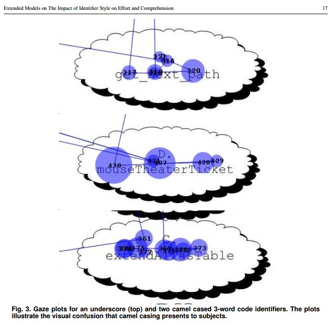
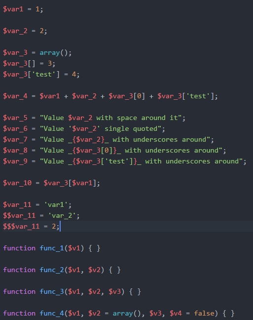
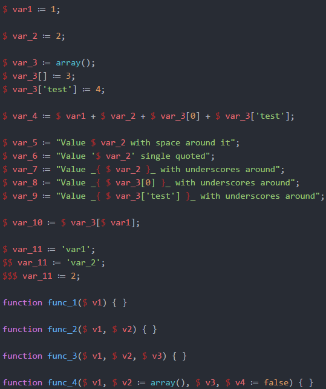

# PHP alternative syntax styling for Atom

## Introduction

Look at the picture below. It shows eye movements and fixations while reading identifiers in `under_score` or `camelCase` style. As you see, `camelCase` introduces a lot of visual confusion and additional work. Larger circles indicate increased mental parsing time needed to process the joined word. Picture is taken from [Extended Models on The Impact of Identifier Style on Effort and Comprehension](http://www.cs.loyola.edu/~binkley/papers/tr-loy110720.pdf) (2012) by Binkley, Davis, Lawrie, Maletic, Morell, Shariff.

Now, think about variables in PHP. They all have dollar sign prefix as their [sigil](https://en.wikipedia.org/wiki/Sigil_(computer_programming)). I do not have a proof and I haven't done any eye-tracking experiments, but I suspect that those dollar signs increase mental parsing times because they do look like a letter `S` and you have to make some additional effort so separate them from proper variable names. *However*, dollar signs help both interpreter and the programmer to quickly find variables in the source code. Do not underestimate this. This single symbol might be better than syntax colouring.

I do propose some alternative syntax styling which helps with visually separating dollars from variable names while keeping them visible to ease finding variables in the code.

## Original dollar styling

## New dollar styling

After applying new CSS rules dollar signs sligthly change their colour and become separated from variable name by a single space:

## Other

### Assignment operator

**⚠ DISABLED DUE TO PROBLEMS WITH COMBINED OPERATORS ⚠**

This is minor change but I really like it (maybe because I rembemer glorious times of programming in Pascal). I propose to visually change `=` to proper assignment sign `≔`. I think it looks really nice and might help to visually catch improper operator in `if` statements.

## Try this yourself!

Add content of [style.less](style.less) to your own Atom stylesheet (File -> Settings -> click on the link "your stylesheet" under "Choose a theme" title), *save changes* and open [examples.php](examples.php). Then open some true production source code *not* written by you and look around, make some edits.

In actual editing work you might need some time to adapt to "automatic" space after dollar and after array closing bracket. Try to delete closing square bracket in `$var_9` example. I don't know at this time how to make this more intuitive. There is another problem with assingment sign, see `$eq_new_line` example.

## Try with ligatures!

This alternative styling works fine with [Fira Code](https://github.com/tonsky/FiraCode) - a monotype font with programming ligatures which changes `->`, `=>`, `==`, `===` and other specific character groups into nice looking single character symbols.
